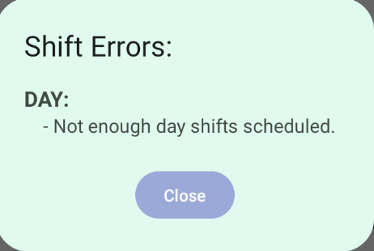

# Little Green Frog Scheduling App

## Team Members
- <a href='https://github.com/dfendr'>Dylan Fender - `dfendr`</a>
- <a href='https://github.com/batec2'>Crush Bate - `batec2`</a>
- <a href='https://github.com/ddonvan'>Daniel Donovan - `ddonvan`</a>
- <a href='https://github.com/mitchelnelson'>Mitchel Nelson - `mitchelnelson`</a>

## Features
### Calendar

The Calendar was designed to allow for user to take a quick glance at the screen and see which days
have people scheduled and which days may have some scheduling errors

### Error and Schedule Generator

Helpful messages in calendar and shift screens to provide more information to user

### Employee List

Consistent with the calendar, the employee list was designed to give the user important information with
 a glance of the screen

### Employee Add/Edit

Intuitive Add/Edit screen to save basic information, and availability information

